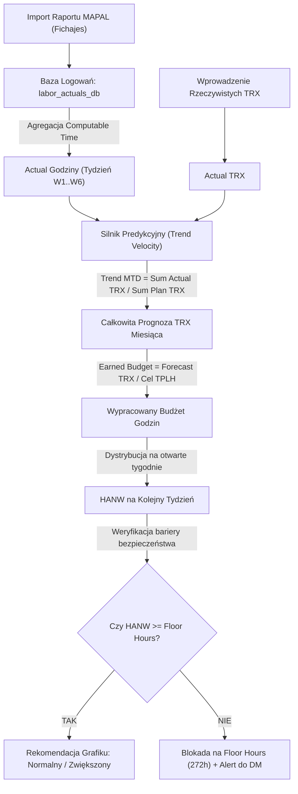

# Specyfikacja Architektoniczna: Desktop Application TPLH Forecast

Dokument stanowi kompletny przewodnik inżynieryjny do przeniesienia arkusza kalkulacyjnego **TPLH Forecast** na nowoczesną, autonomiczną aplikację desktopową (np. **Tauri + React/Vue**, **Electron**, **Python PySide6/PyQt**, lub **Flutter Desktop**).

---

## 1. Domena Biznesowa i Cele Operacyjne

- **Cel aplikacji**: Codzienne i cotygodniowe monitorowanie wykonania rocznego planu AOP (Annual Operating Plan), dynamiczne prognozowanie trendów transakcyjnych (TRX Velocity), kalkulacja budżetu godzin wypracowanych (**Earned Labor Hours**), automatyczny import fizycznych logowań RCP z systemu **MAPAL Fichajes** oraz bezpieczne wyznaczanie obsady grafiku na kolejny tydzień (**HANW — Hours Available Next Week**) przy bezwzględnej ochronie godzin minimalnych (**Floor Hours: 272.0 h/tydz.**).
- **Lokalizacja bazowa**: `108120 SBX Warszawa Janki` (Kod jednostki: `384`).
- **Horyzont wieloletni**: 2021–2036 (16 pełnych lat kalendarzowych, 192 miesiące AOP, 1 152 tygodnie biznesowe).

---

## 2. Silniki Obliczeniowe i Algorytmy



### Algorytm 1: Planowanie Bazowe AOP i Rozbicie Tygodniowe
1. Na każdy miesiąc z bazy AOP pobierany jest: $\text{Plan TRX}$ oraz $\text{Cel TPLH AOP}$.
2. Miesięczny budżet godzin:
   $$\text{Miesięczny Budżet Godzin AOP} = \frac{\text{Plan TRX}}{\text{Cel TPLH AOP}}$$
3. Miesiąc dzieli się na $N \in \{4, 5, 6\}$ tygodni biznesowych Starbucks (wtorek–poniedziałek).
4. Każdy tydzień ma wagę dniową:
   $$W_i = \frac{\text{Liczba Dni w Tygodniu } i}{\text{Liczba Dni w Miesiącu}}$$
5. Tygodniowy Plan TRX: $\text{Plan TRX}_i = \text{Plan TRX} \times W_i$.
6. Tygodniowy Plan Godzin: $\text{Plan Godziny}_i = \text{Miesięczny Budżet Godzin} \times W_i$.

---

### Algorytm 2: Trend Velocity i Całkowita Prognoza Sprzedaży (Forecast Engine)
Gdy zamknięty jest co najmniej jeden tydzień ($Actual TRX > 0$ i $Actual Godziny > 0$):
1. **Wskaźnik Trendu Sprzedaży MTD**:
   $$\text{Trend TRX MTD} = \frac{\sum_{i \in \text{Zamknięte}} \text{Actual TRX}_i}{\sum_{i \in \text{Zamknięte}} \text{Plan TRX}_i}$$
2. **Prognoza TRX na otwarte tygodnie**:
   $$\text{Prognoza TRX}_j = \text{Plan TRX}_j \times \text{Trend TRX MTD} \quad (\text{dla każdego otwartego tygodnia } j)$$
3. **Całkowita Prognoza TRX Miesiąca**:
   $$\text{Forecast Total TRX} = \sum_{i \in \text{Zamknięte}} \text{Actual TRX}_i + \sum_{j \in \text{Otwarte}} \text{Prognoza TRX}_j$$

---

### Algorytm 3: Wypracowane Godziny (Earned Labor Budget) i Rekomendacja HANW
1. **Wypracowany Budżet Miesiąca**:
   $$\text{Earned Labor Budget} = \frac{\text{Forecast Total TRX}}{\text{Cel TPLH AOP}}$$
2. **Wpływ Trendu na Budżet Godzin**:
   $$\Delta_{\text{Earned}} = \text{Earned Labor Budget} - \text{Miesięczny Budżet Godzin AOP}$$
   - Gdy $\Delta_{\text{Earned}} > 0$: Kawiarnia ma prawo dołożyć dodatkowe godziny do grafiku bez psucia TPLH.
   - Gdy $\Delta_{\text{Earned}} < 0$: Sprzedaż spada; wymagana jest redukcja godzin.
3. **Pozostały Budżet do Rozpisania na Otwarte Tygodnie**:
   $$\text{Pozostały Budżet Godzin} = \text{Earned Labor Budget} - \sum_{i \in \text{Zamknięte}} \text{Actual Godziny}_i$$
4. **HANW (Hours Available Next Week — Godziny na Najbliższy Grafik)**:
   Proporcjonalny przydział z uwzględnieniem wagi dniowej kolejnego tygodnia oraz wyrównania odchyleń z przeszłości:
   $$\text{HANW Raw} = \text{Pozostały Budżet Godzin} \times \frac{W_{\text{kolejny}}}{\sum_{j \in \text{Otwarte}} W_j}$$

---

### Algorytm 4: Ochrona Bezwzględna Floor Hours (Floor Hours Engine)
1. **Floor Hours Dnia**:
   - Poniedziałek – Czwartek: 5 zmian po 8h = **40.0 h/dzień**.
   - Piątek – Sobota: 5 zmian po 8h = **40.0 h/dzień**.
   - Niedziela: 4 zmiany po 8h = **32.0 h/dzień**.
   - **Pełny tydzień (7 dni) = 272.0 h**.
   - Tygodnie niepełne (np. 1–3 dni na przełomie miesięcy): suma floor hours dni wchodzących w skład danego tygodnia.
2. **Bariera Bezpieczeństwa**:
   $$\text{HANW Final} = \max(\text{HANW Raw}, \text{Floor Hours}_{\text{kolejny}})$$
   - Jeśli $\text{HANW Raw} < \text{Floor Hours}$: Aplikacja wymusza poziom Floor Hours i wyświetla **Czerwony Alert Bezpieczeństwa**:
     `🚨 KRYTYCZNY DEFICYT: Sprzedaż wymusza cięcia poniżej Floor Hours. Grafik zablokowany na poziomie 272.0 h. Wymagana akceptacja District Managera.`

---

## 3. Schemat Bazy Danych (Data Schema)

Zalecany lekki silnik relacyjny w aplikacji desktopowej: **SQLite** lub **DuckDB**.

### Tabela: `stores`
```sql
CREATE TABLE stores (
    store_code VARCHAR(10) PRIMARY KEY, -- np. '384'
    store_name VARCHAR(100) NOT NULL,   -- np. '108120 SBX Warszawa Janki'
    weekly_floor_hours REAL DEFAULT 272.0,
    created_at TIMESTAMP DEFAULT CURRENT_TIMESTAMP
);
```

### Tabela: `aop_plans` (Pełna Baza 2021–2036)
```sql
CREATE TABLE aop_plans (
    key VARCHAR(30) PRIMARY KEY,        -- np. '2026_Wrzesień'
    year INTEGER NOT NULL,              -- 2026
    month VARCHAR(20) NOT NULL,         -- 'Wrzesień'
    month_code VARCHAR(5) NOT NULL,     -- 'M09'
    weeks_count INTEGER NOT NULL,       -- 5
    plan_trx INTEGER NOT NULL,          -- 10830
    target_tplh REAL NOT NULL,          -- 6.70
    labor_budget REAL NOT NULL,         -- 1616.4
    avg_weekly_hours REAL NOT NULL      -- 323.3
);
```

### Tabela: `calendar_days` (5 844 dni: 2021–2036)
```sql
CREATE TABLE calendar_days (
    date DATE PRIMARY KEY,              -- '2026-09-01'
    year INTEGER NOT NULL,
    month VARCHAR(20) NOT NULL,
    day_of_week VARCHAR(10) NOT NULL,   -- 'Wt', 'Śr'
    business_week VARCHAR(20) NOT NULL, -- 'BW20260901'
    week_number_in_month VARCHAR(5),    -- 'W1'
    week_key VARCHAR(30) NOT NULL,      -- '2026_Wrzesień_W1'
    floor_hours_day REAL NOT NULL       -- 40.0 lub 32.0
);
```

### Tabela: `labor_actuals_log` (Ewidencja zmian z MAPAL)
```sql
CREATE TABLE labor_actuals_log (
    id INTEGER PRIMARY KEY AUTOINCREMENT,
    date DATE NOT NULL,
    year INTEGER NOT NULL,
    month VARCHAR(20) NOT NULL,
    week VARCHAR(5) NOT NULL,
    week_key VARCHAR(30) NOT NULL,
    day_of_week VARCHAR(10),
    employee_name VARCHAR(100) NOT NULL,
    category VARCHAR(50),               -- 'Shift manager/Supervisor', 'Crew', 'Assistant Manager'
    contract_type VARCHAR(50),          -- 'Standard 1,0|40h', 'Zlecenie'
    computable_time REAL NOT NULL,      -- czas naliczony fizyczny
    unit_code VARCHAR(10) NOT NULL,     -- '384'
    unit_name VARCHAR(100) NOT NULL,
    imported_at TIMESTAMP DEFAULT CURRENT_TIMESTAMP,
    CONSTRAINT unique_shift UNIQUE(date, employee_name, unit_code, computable_time)
);
```

### Tabela: `weekly_actual_trx` (Wprowadzane przez Store Managera)
```sql
CREATE TABLE weekly_actual_trx (
    week_key VARCHAR(30) PRIMARY KEY,   -- '2026_Wrzesień_W1'
    actual_trx INTEGER,
    manual_hours_override REAL,
    updated_at TIMESTAMP DEFAULT CURRENT_TIMESTAMP
);
```

---

## 4. Pipeline Importu Raportów MAPAL (Fichajes)

1. **Format pliku**: Eksport z MAPAL Software (`.xls` BIFF8 lub `.xlsx`).
2. **Kluczowa reguła czyszczenia**: Wiersz 6 zawiera nagłówki, **wiersz 7 jest pusty (`[]`)**. Parser musi czytać dane od wiersza 8 wzwyż.
3. **Kryteria biznesowe**:
   - Filtr lokalu: `Unit Code = '384'` lub `Unit Name LIKE '%108120%'`.
   - Kolumna godzin: `Computable Time` (Col J / Col 10).
4. **Idempotencja**: Przy imporcie raportu (np. za tydzień od $D_1$ do $D_2$) aplikacja wykonuje:
   ```sql
   DELETE FROM labor_actuals_log 
   WHERE unit_code = '384' AND date BETWEEN :min_date AND :max_date;
   ```
   a następnie wstawia nowe rekordy, zapobiegając zdublowaniu godzin.

---

## 5. Rekomendowana Architektura Aplikacji Desktopowej

### Opcja A (Zalecana): **Tauri 2.0 + React / Vite + SQLite**
- **Zalety**: Niezwykle lekka aplikacja (plik instalacyjny poniżej 15 MB), zużycie RAM < 60 MB, natywny instalator macOS (.dmg / .app) i Windows (.msi / .exe).
- **Backend (Rust / SQLite)**: Błyskawiczny parser plików Excel (`calamine` w Rust czyta `.xls` 100x szybciej niż Excel), obsługa bazy SQLite.
- **Frontend (React / Tailwind / shadcn/ui)**: Nowoczesny dashboard w ciemnym motywie Starbucks, animowane wykresy (Recharts / Chart.js), responsywny layout.

### Opcja B: **Python PySide6 (Qt) / CustomTkinter**
- **Zalety**: Cała logika z `import_fichajes.py` i biblioteki `openpyxl`/`xlrd` działają bezpośrednio bez przepisywania.
- **Wady**: Większy rozmiar instalatora (ok. 60–90 MB).

---

## 6. Projekt Interfejsu Użytkownika (UI Mockup)

```
+--------------------------------------------------------------------------------------------------+
| STARBUCKS | TPLH Forecast & Labor Balancing                      [ Rok: 2026 v ] [ Wrzesień v ]  |
+--------------------------------------------------------------------------------------------------+
| [📥 Importuj Fichajes (MAPAL)]  [📊 Baza AOP]  [📋 Baza RCP]  [⚙️ Floor Hours]  [🔒 Tryb Kioskowy] |
+--------------------------------------------------------------------------------------------------+
|  1. PLAN AOP NA MSC   |  2. WYKONANIE MTD     |  3. REKOMENDACJA HANW |  4. FLOOR HOURS         |
|  Plan TRX: 10 830     |  Godziny: 377.3 h     |  Limit: 382.4 h       |  Floor Tyg.: 272.0 h    |
|  Cel TPLH: 6.70       |  Odchyl.: -14.2 h     |  Korekta vs AOP: +5h  |  Margines: +110.4 h     |
|  Budżet: 1 616.4 h    |  Actual TPLH: 6.42    |  Earned: 1 645.0 h    |  Status: BEZPIECZNY     |
+--------------------------------------------------------------------------------------------------+
| 💡 REKOMENDACJA OPERACYJNA:                                                                      |
| Sprzedaż stabilna (+2.1% MTD). Rozpisz grafik W3 w granicach 382 h (bezpieczny margines +110h).  |
+--------------------------------------------------------------------------------------------------+
| TABELA TYGODNIOWA (W1..W6):                                                                      |
| Tydz | Daty         | Dni | Typ  | Plan TRX | Act TRX | Act Godz | Plan TPLH | Act TPLH | HANW      |
| W1   | 01.09-07.09  | 7   | Full | 2 527    | 2 050   | 333.9    | 6.70      | 6.14     | -         |
| W2   | 08.09-14.09  | 7   | Full | 2 527    | -       | 43.4     | 6.70      | -        | -         |
| W3   | 15.09-21.09  | 7   | Full | 2 527    | -       | -        | 6.70      | -        | 382.4 h   |
| W4   | 22.09-28.09  | 7   | Full | 2 527    | -       | -        | 6.70      | -        | 382.4 h   |
| W5   | 29.09-30.09  | 2   | Part | 722      | -       | -        | 6.70      | -        | 92.8 h    |
+--------------------------------------------------------------------------------------------------+
| [ WYKRES SŁUPKOWY: Cel TPLH AOP vs Actual TPLH po Tygodniach ]                                  |
+--------------------------------------------------------------------------------------------------+
```
